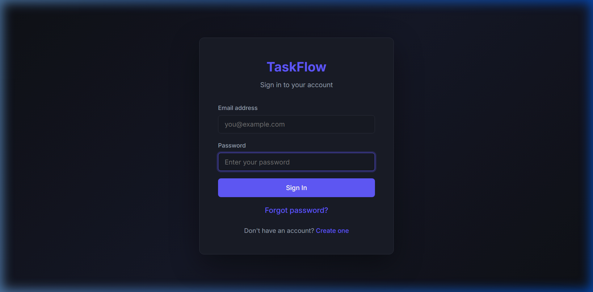
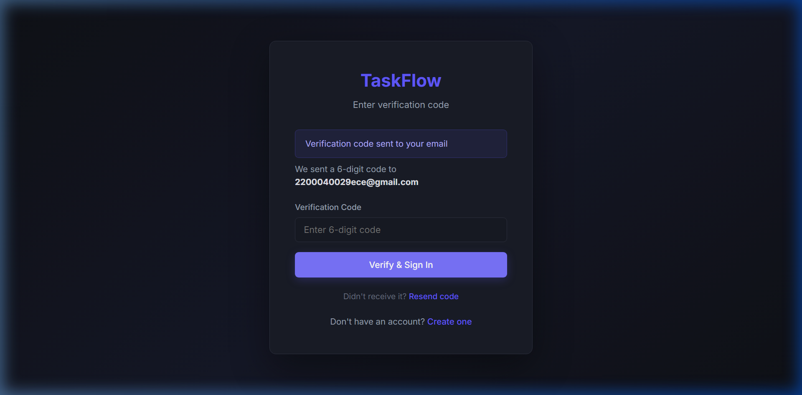
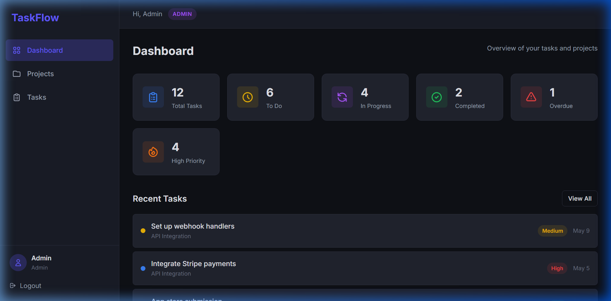
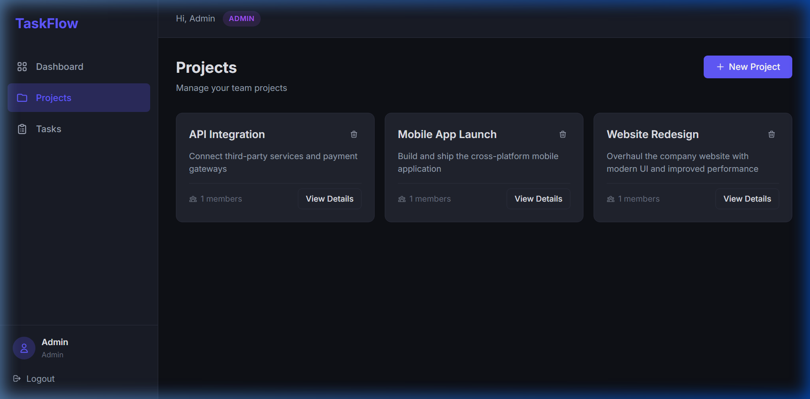
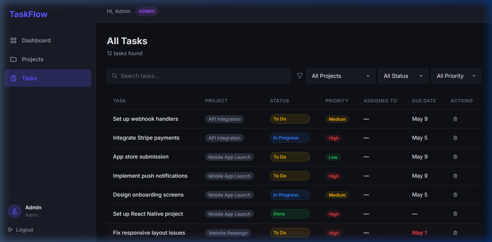

# TaskFlow — Team Task Manager

A full-stack collaborative task management app built with React, Express, MongoDB, and SendGrid. Teams can create projects, assign tasks with priorities and deadlines, and track everything from a central dashboard.

🔗 **Live Demo:** [team-task-manager-production-9c87.up.railway.app](https://team-task-manager-production-9c87.up.railway.app)

🎥 **Demo Video:** [Watch the full walkthrough](https://drive.google.com/file/d/1gZEJghye1w3hRlFe0q7yfHUciXN4FeYJ/view?usp=sharing)

> To add inline playback: Edit this README on GitHub, drag-drop your `.mp4` file below, then delete this note.


---

## Screenshots

| Login | OTP Verification |
|-------|-----------------|
|  |  |

| Dashboard | Projects |
|-----------|----------|
|  |  |

| Task Board |
|-----------|
|  |

---

## Features

- Two-step email OTP authentication (register, login, password reset)
- Welcome email on account activation
- Create and manage team projects
- Invite members by email
- Create tasks with title, description, priority, status, due date, and assignee
- Task workflow: To Do → In Progress → Done
- Priority levels: Low, Medium, High
- Overdue task detection and highlighting
- Dashboard with real-time analytics and stats
- Search and filter tasks across projects
- Role-based access control (Admin / Member)
- Self-ping keep-alive to prevent server sleeping on Railway

### Roles

| | Admin | Member |
|-|:-----:|:------:|
| Create/delete projects | ✔ | ✘ |
| Add/remove members | ✔ | ✘ |
| Create tasks | ✔ | ✔ |
| Update task status | ✔ | ✔ (own/assigned) |
| Delete tasks | ✔ | ✔ (own) |
| View dashboard | ✔ | ✔ |

---

## ⚠️ Note on OTP Emails

Since OTP emails are sent from a `gmail.com` address via SendGrid servers, **they may land in Spam/Junk** on some providers (especially Gmail). This is because SendGrid's mail servers don't align with Gmail's SPF/DKIM records.

**Workaround:**
- Check your Spam folder
- Mark it as "Not Spam" — future emails will go to inbox
- Add the sender to your contacts

This can be fully resolved with custom domain authentication (SPF + DKIM + DMARC), but for a free-tier project without a purchased domain, single-sender verification is the practical choice.

---

## Tech Stack

| Layer | Tech | Why This |
|-------|------|----------|
| Frontend | React 19, Vite, React Router v7 | Component-driven UI, instant HMR, client-side routing with protected routes |
| Backend | Node.js, Express.js | Same language across the stack, lightweight and flexible |
| Database | MongoDB Atlas + Mongoose | Schema-flexible documents, free cloud hosting, TTL indexes for OTP auto-expiry |
| Auth | JWT + bcryptjs + email OTP | Stateless tokens, hashed passwords, no third-party auth dependency |
| Email | SendGrid (@sendgrid/mail) | HTTPS API that works on Railway (SMTP ports are blocked) |
| Validation | express-validator | Native Express middleware, no extra config |
| Icons | react-icons (Heroicons) | Lightweight SVG icons |
| Hosting | Railway (nixpacks) | Full-stack deployment, auto-deploy from GitHub, free tier |
| Styling | Custom CSS | Dark theme with glassmorphism, full design control, smaller bundle |

### Why SendGrid for Email?

We evaluated four services before landing on SendGrid:

| Service | Problem |
|---------|---------|
| Nodemailer + Gmail SMTP | Railway blocks SMTP ports (25, 465, 587) |
| Brevo (Sendinblue) | Account activation takes 24–48 hours |
| Resend | Free tier only sends to account owner's email |
| **SendGrid** ✅ | Instant activation, HTTPS API (port 443), 100 emails/day free |

SendGrid communicates over standard HTTPS, so it bypasses Railway's SMTP restrictions entirely. Paired with disabled tracking links and multipart emails (HTML + plain text), deliverability is maximized.

### Why These Over Alternatives?

| Decision | Chosen | Considered | Reasoning |
|----------|--------|------------|-----------|
| Frontend | React + Vite | Angular, Vue, CRA | CRA is deprecated; Angular has too much boilerplate for this scale; Vite is significantly faster |
| Backend | Express | Django, Flask | Full-stack JS means no language switching; Express is minimal and unopinionated |
| Database | MongoDB | PostgreSQL | Document model maps directly to JSON; no migration headaches when schema evolves |
| Auth | JWT + OTP | Sessions, OAuth | Stateless (no Redis/session store); OTP is more reliable than magic links across email clients |
| Hosting | Railway | Vercel, Render, Heroku | Vercel is frontend-focused; Render has slow cold starts; Heroku killed free tier |
| CSS | Custom | Tailwind, MUI | Smaller bundle; no 15-class divs; full control over the dark theme |

---

## Project Structure

```
client/
├── src/
│   ├── components/        Navbar, ProtectedRoute, Layout
│   ├── context/           AuthContext (JWT + user state)
│   ├── pages/             Login, Register, ForgotPassword,
│   │                      Dashboard, Projects, ProjectDetail, Tasks
│   ├── services/          Axios API client
│   ├── App.jsx            Route config
│   └── index.css          Dark theme styles
└── package.json

server/
├── config/db.js           MongoDB connection
├── middleware/auth.js      JWT verify + role guards
├── models/
│   ├── User.js            name, email, password(hashed), role, isVerified
│   ├── Project.js         name, description, owner, members[]
│   ├── Task.js            title, status, priority, dueDate, assignedTo
│   └── OTP.js             email, code, purpose, expiresAt(TTL)
├── routes/
│   ├── auth.js            Register, login, OTP, password reset
│   ├── projects.js        CRUD + member management
│   └── tasks.js           CRUD + dashboard aggregation
├── utils/sendEmail.js     SendGrid integration
├── seed.js                Default admin seeder
├── index.js               Entry point + keep-alive ping
└── package.json

nixpacks.toml              Railway build config
```

---

## API Endpoints

### Auth
| Method | Endpoint | Description |
|--------|----------|-------------|
| POST | `/api/auth/register` | Create account → sends OTP |
| POST | `/api/auth/verify-register` | Verify OTP → activate account |
| POST | `/api/auth/login` | Check credentials → sends OTP |
| POST | `/api/auth/verify-login` | Verify OTP → returns JWT |
| POST | `/api/auth/forgot-password` | Sends reset OTP |
| POST | `/api/auth/reset-password` | Verify OTP → update password |
| POST | `/api/auth/resend-otp` | Resend code (register/login/reset) |
| GET | `/api/auth/me` | Current user profile (🔒) |

### Projects
| Method | Endpoint | Description |
|--------|----------|-------------|
| GET | `/api/projects` | Your projects (🔒) |
| POST | `/api/projects` | Create project (🔒 Admin) |
| GET | `/api/projects/:id` | Project details (🔒) |
| PUT | `/api/projects/:id` | Update project (🔒 Admin) |
| DELETE | `/api/projects/:id` | Delete project + tasks (🔒 Admin) |
| POST | `/api/projects/:id/members` | Add member by email (🔒 Admin) |
| DELETE | `/api/projects/:id/members/:uid` | Remove member (🔒 Admin) |

### Tasks
| Method | Endpoint | Description |
|--------|----------|-------------|
| GET | `/api/tasks` | List with filters (🔒) |
| POST | `/api/tasks` | Create task (🔒) |
| GET | `/api/tasks/:id` | Task details (🔒) |
| PUT | `/api/tasks/:id` | Update task (🔒) |
| DELETE | `/api/tasks/:id` | Delete task (🔒) |
| GET | `/api/tasks/dashboard/stats` | Dashboard numbers (🔒) |

### System
| Method | Endpoint | Description |
|--------|----------|-------------|
| GET | `/api/health` | Server status + config check |

---

## Setup

### Prerequisites
- Node.js 18+
- MongoDB Atlas account ([free tier](https://mongodb.com/atlas))
- SendGrid account ([free — 100 emails/day](https://sendgrid.com))

### Install

```bash
git clone https://github.com/SATVIK202004/team-task-manager.git
cd team-task-manager
npm run install:all
```

### Configure

Create `server/.env`:
```env
PORT=5000
MONGO_URI=your_mongodb_connection_string
JWT_SECRET=any_random_secret
NODE_ENV=development
SENDGRID_API_KEY=SG.your_key_here
SENDGRID_FROM_EMAIL=your_verified_email@gmail.com
```

**SendGrid setup:** Sign up → Settings → Sender Authentication → verify your email → API Keys → Create API Key → copy it.

### Run

```bash
npm run dev
```
Backend: `http://localhost:5000` · Frontend: `http://localhost:5173`

---

## Deploy to Railway

1. Push to GitHub
2. New project on [railway.app](https://railway.app) → connect repo
3. Set environment variables:

| Variable | Value |
|----------|-------|
| `MONGO_URI` | MongoDB connection string |
| `JWT_SECRET` | Random secret |
| `NODE_ENV` | `production` |
| `SENDGRID_API_KEY` | Starts with `SG.` |
| `SENDGRID_FROM_EMAIL` | Verified sender email |

4. Deploy — Railway handles build + start automatically

**Keep-alive:** The server pings its own `/api/health` endpoint every 12 minutes in production to prevent Railway from sleeping the service. Uses `RAILWAY_PUBLIC_DOMAIN` (auto-set by Railway). No cron jobs or external services needed.

---

## Database Schema

```
User        → name, email(unique), password(bcrypt), role(admin|member), isVerified
Project     → name, description, owner→User, members→[User]
Task        → title, description, status, priority, dueDate, project→Project, assignedTo→User, createdBy→User
OTP         → email, code(6-digit), purpose(register|login|reset), expiresAt(TTL auto-delete)
```

---

## Author

**Satvik Peddisetty**

## License

MIT
